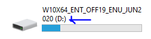
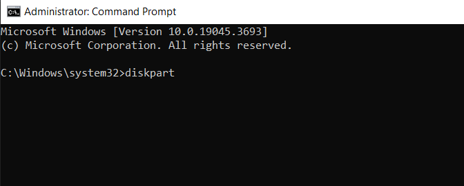
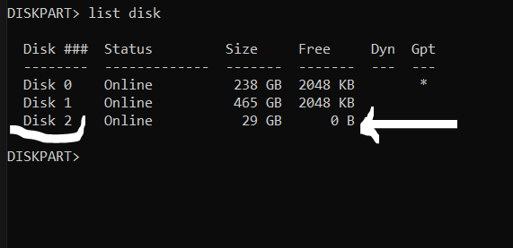
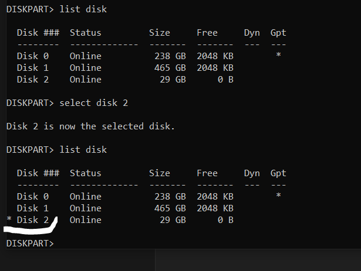
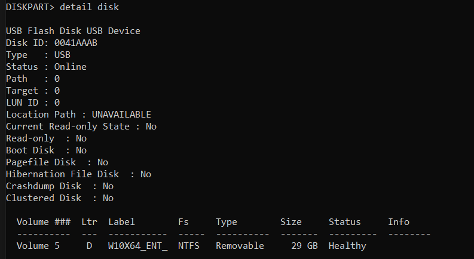
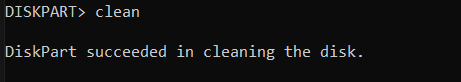
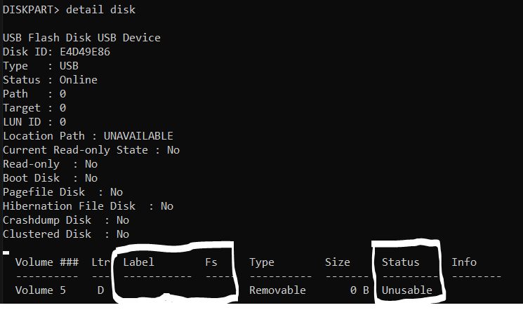
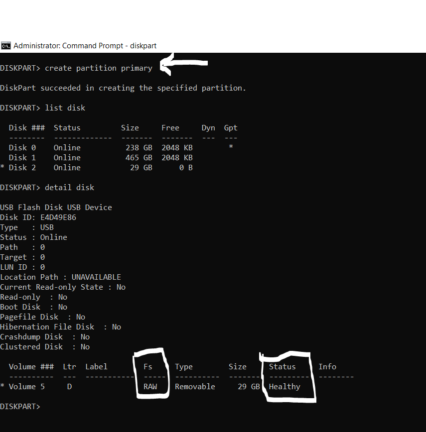
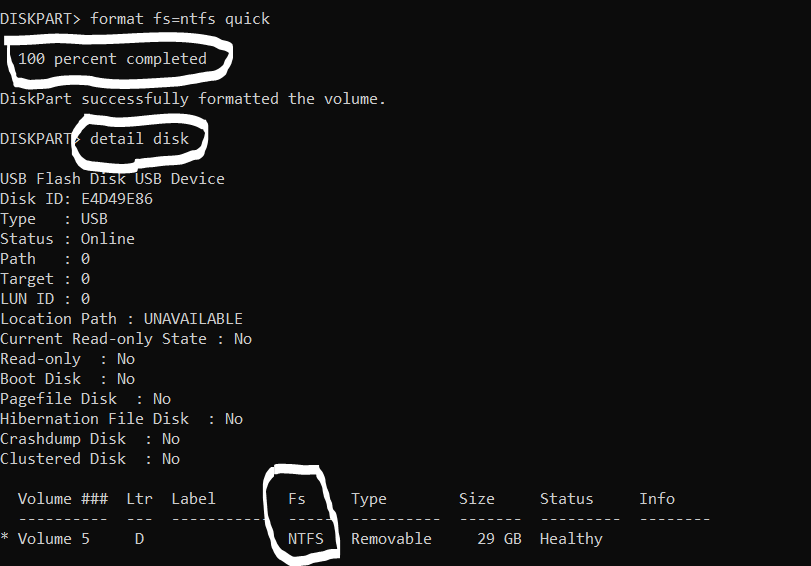

# CLEANING AND FORMATTING A USB DRIVE WITH COMMAND PROMPT 

## UNDERSTANDING THE KEY WORDS

    FS: File System, also known as filesystem or fs, is a method and data structure that the operating  system uses to control how data is stored and retrieved. By separating the data into pieces and giving   each a name, the data is easily isolated and identified. Taking its name from the way a paper-based   data management system is named, each group of data is called a 'file'. The structure and logic rules     used to name the groups of data and their names is called a 'file system'.

## Types of FS

    NTFS: NTFS file system, known as New Technology File System (NTFS), is a proprietary journaling file    system developed by Microsoft. Starting with Windows NT 3.1, it is the default file system of the  Windows NT family. It superseded File Allocation Table (FAT) as the preferred filesystem on Windows and  is supported in Linux and BSD as well.

    FAT32: is a file system that was first introduced with Windows 95. It is an older file system that's    not as efficient as NTFS. 

    exFAT: Extended File Allocation Table, has large compatibilities and limits on file and partition   sizes. It was introduced with Windows XP and Vista operating system. It Works for all versions of     Windows and Mac. It can also work with Linux if you have downloaded additional software on your PC. It  is a modern replacement for FAT32.


This is a guide on how to clean and format a USB Drive using the command line interface (Command Prompt)

## REQUIREMENTS
- You must have a USB Drive (Pen Drive)
- The USB Drive should be **Empty** OR do not contain Important Data
- If the Drive Contains Important Data, Make sure to move it to different location before proceeding with this, since all the data in the USB Drive will be overwriten
- You should have access to any Windows PC (win7, 8, 10, or 11)

### GETTING STARTED

#### Step 1. You will need to insert the USB drive into the USB Port of your PC
- Make sure the Drive is connected and verify the Letter assigned to the USB Drive (e.g. *D*)



#### Step 2. Click on the **start button** and search for **Command Prompt** 

#### Step 3. Right Click on the **Command Prompt** and select **Run as Administrator** and click on *Yes*

#### Step 4. Starting the Diskpart

```
diskpart
```



#### Step 5. Listing the Available Disk connected to the PC

```
list disk
```



#### Step 6. Take note of the USB Drive you wish to clean and format and confirm the Disk Number (e.g Disk 2)

#### Step 7. Selecting the disk you wish to clean

```
select disk 2
```

#### Step 8. Verify that the Disk 2 is now the selected disk, you will notice that there is Star (*) attached the **Disk 2**, this shows that, the **Disk 2** is the selected Disk

```
list disk
```



#### Step 9. Show the details of the selected disk, to check it's Status, Size and Volume Label

```
detail disk
```



#### Step 10. Cleaning the Disk

```
clean
```



#### Step 11. Verify the changes to the USB Drive after cleaning it
Note: The *Label, and FS,*  are empty and the *Status* of the USB drive is *Unusable* (FS = File System)

```
detail disk
```




#### Step 12. Creating a new partition on the USB Drive.

```
create partition primary
```

Note the changes on the USB Drive after creating the Partition, (FS, and Status), 
```
detail disk
```

The FS for the USB drive is RAW, we will need to now format it and convert the FS from RAW to any of the following File Systems (FS)

- NTFS
- FAT32
- exFAT



#### Step 13. Formating the Drive (Note: you need to add *quick* if you want the formatting process to be very quick) 
Note that the *fs=ntfs* tells the system that we want to change the file system to NTFS, you can decide to use different File System such as FAT32, exFAT.

```
format fs=ntfs quick
```

Note the changes on the USB Drive after formatting it, (FS, and Status), 
```
detail disk
```



type *exit* to exit from the diskpart 

type *exit* to exit from the command prompt

### THANK YOU FOR TAKING SOME TIME TO READ THIS WALK THROUGH, I HOPE THIS HELPS